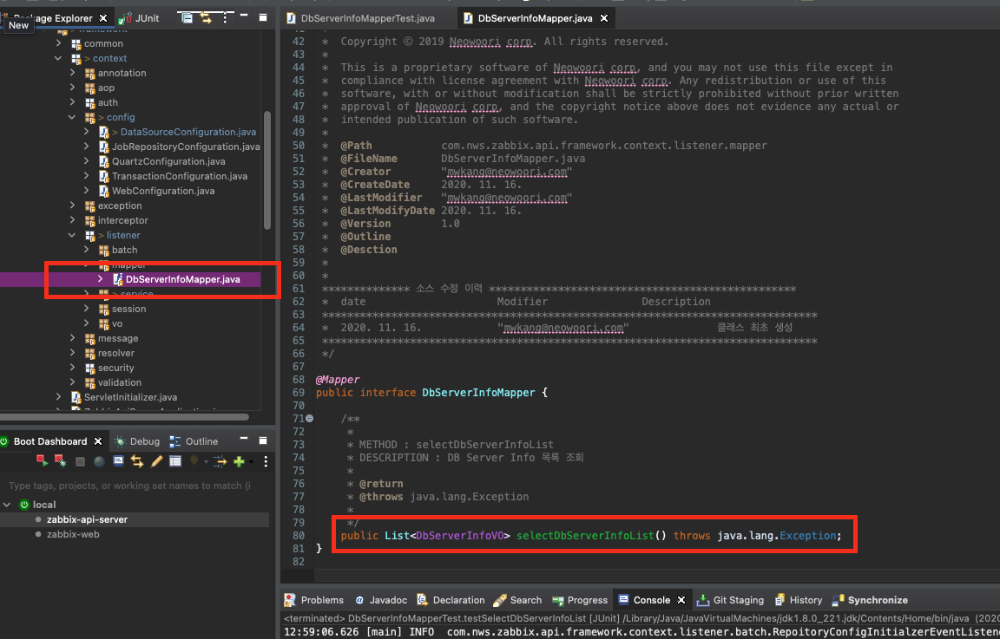

# 01 Mapper Junit으로 테스트하기

- 이미지, 코드 및 설명
- 각 Annotation 설명


## 1.1 Mapper 클래스 Junit test 이미지, 코드 및 설명

우선 Test할 Mapper Interface를 다음과 같이 Junit Test Case로 만들어 준다.

<br>
<br>


<br>

다음과 같이 테스트할 메소드를 선택한다.

<br>

정상적으로 선택이 완료되면 다음과 같이 Test case가 생성된다.

<br>

다음과 같이 코드를 작성해준다.

```
@RunWith(SpringRunner.class)
@SpringBootTest
@FixMethodOrder(MethodSorters.NAME_ASCENDING)
@Slf4j
public class DbServerInfoMapperTest2 {

	
	@Autowired
	DbServerInfoMapper dbServerInfoMapper;
	
	/**
	 * Test method for {@link com.nws.zabbix.api.framework.context.listener.mapper.DbServerInfoMapper#selectDbServerInfoList()}.
	 */
	@Test
	public void testSelectDbServerInfoList() {
		try {
			log.info("test123456:{}",dbServerInfoMapper.selectDbServerInfoList());
		} catch (Exception e) {
			// TODO Auto-generated catch block
			e.printStackTrace();
		}
	}

}
```

코드 작성후 Junit Test를 진행해주자.

<br>

코드를 실행하면 다음과 같이 정상적으로 해당 맵퍼가 실행된 것을 확인할 수 있다.


## 1.2 각 Annotation 설명

- *@RunWith*(SpringRunner.class)
- *@SpringBootTest*
- *@FixMethodOrder*(*MethodSorters*.***NAME_ASCENDING\***)